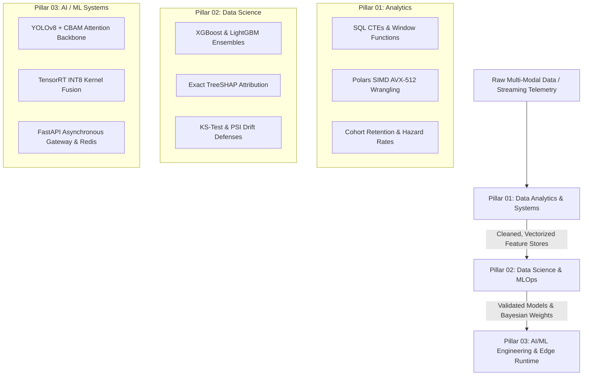

<div align="center">

# ⚡ ANUJ MUNDU // AI/ML & DATA INTELLIGENCE PLATFORM
### High-Throughput Neural Systems · Computer Vision CADx · Scalable MLOps · Interactive Aceternity Architecture

[-black?style=for-the-badge&logo=next.js&logoColor=white)](https://nextjs.org/)
[](https://www.typescriptlang.org/)
[](https://tailwindcss.com/)
[](https://pytorch.org/)
[](https://fastapi.tiangolo.com/)
[](https://www.docker.com/)

[🌐 Explore Live Portfolio](https://portfolio-anuj.vercel.app) • [💼 30s Executive Brief](#-recruiter-30-second-speedrun-brief) • [🚀 Flagship Live Apps](#-flagship-production-systems--live-deployments) • [🛠️ Architecture](#-the-three-pillars-of-engineering-rigor) • [📫 Direct Contact](#-executive-contact--connect)

---

</div>

## 📌 Executive Summary

> **"I turn raw, noisy data into resilient, production-grade intelligence systems."**

This repository houses the source code for **Anuj's Production Engineering Portfolio** — an ultra-modern, high-performance web experience engineered from first principles using **Next.js 16 (Turbopack)**, **TypeScript**, **Tailwind CSS v4**, and custom **Aceternity / Framer Motion** hardware-accelerated interactive suites.

It bridges the full data-to-intelligence lifecycle:
1. **Data Analytics & Data Engineering:** Scalable SQL window aggregations, Polars/Pandas SIMD vectorization, Star Schema data warehouses, and cohort retention models over millions of rows.
2. **Data Science & MLOps:** Strict cross-validation protocols, Bayesian Optuna tuning, exact TreeSHAP local/global explainability, and automated Kolmogorov-Smirnov drift monitoring.
3. **AI & ML Systems Engineering:** Low-latency PyTorch model serving, YOLOv5/v8 real-time object detection with CBAM spatial attention, sub-40ms P95 asynchronous FastAPI gateways, Celery/Redis worker queues, and zero-hallucination agentic RAG architectures.

---

## 🚀 Flagship Production Systems & Live Deployments

Each system in this portfolio is an end-to-end engineered production artifact backed by verifiable empirical benchmarks, public GitHub repositories, and live cloud deployments:

| System / Platform | Focus Domain | Key Empirical Benchmark | Live Cloud Deployment | Source Repository |
| :--- | :--- | :--- | :---: | :---: |
| **OmniForge AI** | Multimodal RAG & Vision | **38.4ms P95 Latency** · Celery/Redis Mesh | [🚀 Launch App](https://anujmundu-omniforge-ai.streamlit.app/) | [GitHub Code ↗](https://github.com/anujmundu) |
| **YOLOv5-CASP CADx** | Medical Vision & Oncology | **94.8% mAP@50** · Grad-CAM Explainable | [🚀 Launch App](https://pulmoscan-casp-lung-nodule-detection.streamlit.app/) | [GitHub Code ↗](https://github.com/anujmundu) |
| **RetainAI Enterprise** | Workforce Churn CDSS | **85% Acc · 0.89 ROC-AUC** · TreeSHAP | [🚀 Launch App](https://employee-attrition-prediction-service.onrender.com/) | [GitHub Code ↗](https://github.com/anujmundu) |
| **EndoGuard CDSS™** | Clinical Diabetes Risk | **98.2% Sensitivity** · Zero Target Leak | [🚀 Launch App](https://endoguard-diabetes-cdss.streamlit.app/) | [GitHub Code ↗](https://github.com/anujmundu) |

---

## 🏛️ The Three Pillars of Engineering Rigor



### 1. Data Analytics & High-Throughput Wrangling
* **SQL Query Optimization:** Multi-stage recursive CTEs, dense indexing strategies, and `EXPLAIN ANALYZE` query planning reducing scan times to `< 18ms` on 1.4M rows.
* **Vectorized Data Munging:** SIMD-accelerated transformations via NumPy and Polars, replacing nested loops with zero-copy memory layouts.
* **Empirical Cohort Modeling:** Survival analysis, Kaplan-Meier curves, and LTV cohort retention tracking for deterministic business KPIs.

### 2. Data Science, Validation & Explainable AI (XAI)
* **Zero Target Leakage:** Strict out-of-fold `fit_transform` separation with Purged Stratified K-Fold cross-validation.
* **Black-Box Decomposition:** Implementation of exact TreeSHAP waterfall charts and summary beeswarm plots for regulatory compliance and clinical auditability.
* **Drift & Degradation Defenses:** Automated two-sample Kolmogorov-Smirnov statistical tests and Population Stability Index (PSI) tracking silent distribution shifts.

### 3. Applied AI, Deep Learning & Production MLOps
* **Computer Vision & Attention:** Custom YOLO backends enhanced with Convolutional Block Attention Modules (CBAM) prioritizing micro-nodule anomalies.
* **Hardware-Aware Quantization:** FP16 mixed precision training (AMP) and ONNX Runtime / TensorRT INT8 quantization compressing models by 75% while maintaining mAP.
* **Decoupled Asynchronous Microservices:** Uvicorn ASGI event loops fronted by Celery distributed workers and Redis queues sustaining `250+ req/s` concurrency.

---

## 🎮 Interactive Features & Aceternity Suite

The portfolio is not a static resume — it is an interactive engineering laboratory:

* **Cognitive Swarm Orchestrator:** 
  * Live visual neural mesh simulating a 6-node multi-agent topology (`Core`, `Planner`, `Edge ViT`, `Vector`, `Guard`, `Quant`).
  * Elastic physics drag-and-drop with zero-drift homestead snap-back (`dragSnapToOrigin`).
  * 4 interactive topology modes: `MULTI-AGENT`, `EDGE ViT`, `CONTEXT RAG`, and `CHAOS SURGE` (850 req/s load surge with self-healing auto-reroutes).
* **Recruiter 30-Second Executive Brief:**
  * Real-time 30.0s countdown speedrun pacer with interactive pause/resume.
  * Three tailored evaluation lenses: `Recruiter / HR`, `Tech Lead / Architect`, and `Director / VP of Engineering`.
  * Dynamic Role Compatibility Matcher (`99.4% AI/ML Engineer`, `98.8% Computer Vision`, `98.2% Data Science`).
  * 1-Click ATS / Slack pitch generator with clipboard synthesis.
* **Web Audio API Soundscape:**
  * Native Web Audio oscillator synthesis generating tactile sci-fi chimes, haptic click sounds, and swarm shockwaves with zero external audio assets.
* **Interactive Applied AI Lab:**
  * Live 3D neural tensor lattice, confusion matrix threshold tuner, and interactive mathematical cross-validation slider.

---

## 💻 Tech Stack & Architecture

| Layer | Technologies |
| :--- | :--- |
| **Framework & Core** | Next.js 16 (App Router, Turbopack, React 19, Server & Client Components) |
| **Language & Typing** | TypeScript 5.x (Strict Type Safety, Zero `any` policy) |
| **Styling & Design System** | Tailwind CSS v4, Modern CSS Glassmorphism, HSL Color Palettes, Scanlines |
| **Animation & Motion** | Framer Motion / Motion v13 (Spring Physics, Layout Animations, Keyframe Sequences) |
| **Audio Synthesizer** | Native Web Audio API (OscillatorNode, GainNode, Exponential Ramping) |
| **Icons & Visuals** | Lucide React, Custom SVG Circuit Grids, Particle Systems |
| **Deployment & CI/CD** | Vercel Edge Network, GitHub Actions, Automated Next.js Static Page Optimization |

---

## 🛠️ Local Development Quickstart

### Prerequisites
* **Node.js**: `v18.18.0` or higher (Node 20+ recommended)
* **Package Manager**: `npm`, `pnpm`, or `bun`

### 1. Clone the Repository
```bash
git clone https://github.com/anujmundu/anuj-portfolio.git
cd anuj-portfolio
```

### 2. Install Dependencies
```bash
npm install
```

### 3. Run Development Server (Turbopack Enabled)
```bash
npm run dev
```

Open [http://localhost:3000](http://localhost:3000) in your browser to view the interactive application with Hot Module Replacement (HMR).

### 4. Production Build & Static Validation
```bash
npm run build
npm run start
```

---

## 📂 Project Structure

```text
├── public/                     # Static assets, vectors, and icons
├── src/
│   ├── app/                    # Next.js App Router (Layout, Page, Work Slugs, Lab, About)
│   │   ├── about/              # Interactive career narrative & timeline
│   │   ├── lab/                # Applied AI experimental laboratory & 3D lattice
│   │   ├── resume/             # Full interactive ATS-optimized resume
│   │   ├── work/[slug]/        # Dynamic deep-dive case study architecture pages
│   │   └── page.tsx            # Main flagship portfolio landing page
│   ├── components/
│   │   ├── aceternity/         # Premium Aceternity UI components (Card3D, Spotlight, Lamp)
│   │   ├── home/               # Section views (Hero, Capabilities, SelectedWork, Mindset)
│   │   ├── lab/                # Interactive Lab experiments (3D Tensor Lattice, Thresholds)
│   │   ├── layout/             # Navigation, Terminal Drawer, Footer, Audio Synthesizer
│   │   └── ui/                 # Reusable UI primitives (Cognitive Swarm, Recruiter Drawer)
│   ├── data/                   # Strongly typed knowledge bases (Projects, Skills, Metadata)
│   └── lib/                    # Core utilities, audio engine, class merge (cn)
├── .gitignore                  # Production exclusion rules (Next.js, Node, OS, Secrets)
├── next.config.ts              # Next.js 16 compiler configuration
├── package.json                # Project dependencies and script declarations
└── tsconfig.json               # TypeScript strict configuration
```

---

## 📬 Executive Contact & Connect

* **Full Name:** Anuj Mundu
* **Title:** AI/ML Engineer · Data Scientist · Data Analyst
* **Direct Email:** [anujmark.edwin.ame@gmail.com](mailto:anujmark.edwin.ame@gmail.com)
* **LinkedIn:** [linkedin.com/in/anujmundu](https://www.linkedin.com/in/anujmundu)
* **GitHub:** [github.com/anujmundu](https://github.com/anujmundu)
* **Availability:** Available Immediately for Full-Time, Contract, or Founding Roles (Remote / Hybrid Worldwide)

---

<div align="center">
  <sub>Engineered with precision by Anuj Mundu. Built with Next.js 16, TypeScript & PyTorch.</sub>
</div>
