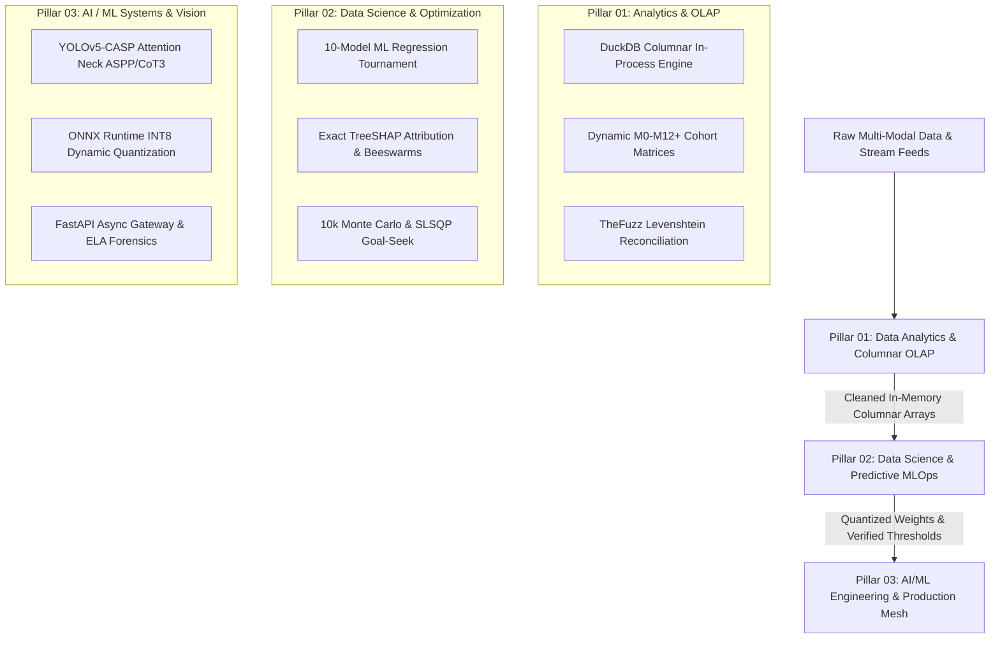

<div align="center">

# ⚡ ANUJ MUNDU // AI/ML & DATA INTELLIGENCE PLATFORM
### High-Throughput Neural Systems · Columnar OLAP Analytics · Computer Vision CADx · Scalable MLOps · Interactive Aceternity Suite

[-black?style=for-the-badge&logo=next.js&logoColor=white)](https://nextjs.org/)
[](https://www.typescriptlang.org/)
[](https://tailwindcss.com/)
[](https://pytorch.org/)
[](https://fastapi.tiangolo.com/)
[](https://duckdb.org/)
[](https://www.docker.com/)

[🌐 Explore Live Portfolio](https://anujmundu-portfolio.netlify.app) • [💼 30s Executive Brief](#-recruiter-30-second-speedrun-brief) • [🚀 11 Live Cloud Apps](#-flagship-production-systems--live-deployments) • [🔬 Benchmark Repositories](#-high-assurance-architectural-benchmarks) • [📋 STAR Resume Bullets](#-recruiter-star-bullet-points--interview-talking-points) • [📫 Direct Contact](#-executive-contact--connect)

---

</div>

## 📌 Executive Summary

> **"I turn raw, noisy data into resilient, production-grade intelligence systems."**

This repository houses the source code for **Anuj's Production Engineering Portfolio** — an ultra-modern, high-performance web platform engineered from first principles using **Next.js 16 (Turbopack)**, **TypeScript**, **Tailwind CSS v4**, and custom **Aceternity / Framer Motion** hardware-accelerated interactive suites.

It bridges the full data-to-intelligence lifecycle:
1. **Data Analytics & Columnar OLAP Systems:** In-process DuckDB columnar engines aggregating 541k+ transactions in `<1.2s`, dynamic M0–M12+ cohort retention matrices, Levenshtein fuzzy reconciliation, and star-schema dimensional modeling.
2. **Data Science & Production MLOps:** 10-algorithm ML regression tournaments, exact TreeSHAP explainability, 10,000-iteration Monte Carlo liquidity stress testing, SLSQP constrained budget optimization, and automated Kolmogorov-Smirnov drift monitoring.
3. **AI & ML Systems Engineering:** Asynchronous FastAPI microservices (`P95 < 65ms`), Error Level Analysis (ELA forensics), 11-architecture vision benchmarks with 3.01x ONNX INT8 acceleration, YOLOv5-CASP clinical CADx with Lung-RADS™ PACS viewers, and zero-shot adversarial red-team guardrails.

---

## 🚀 Flagship Production Systems & Live Deployments

Each system in this portfolio is an end-to-end engineered production artifact backed by verifiable empirical benchmarks, public GitHub repositories, and live cloud deployments:

| # | System / Platform | Focus Domain | Key Empirical Benchmark | Live Cloud Deployment | Source Repository |
| :---: | :--- | :--- | :--- | :---: | :---: |
| **01** | **PulseMetrics Copilot™** | SaaS Analytics & OLAP | **541k+ Rows in <1.2s** · M0–M12+ Cohort Heatmaps | [🚀 Launch App](https://pulsemetrics-bi.streamlit.app/) | [GitHub Code ↗](https://github.com/anujmundu/pulsemetrics-bi) |
| **02** | **OmniVision DocIntel API™** | Document Forensics & CV | **P95 < 65ms** · Error Level Analysis ($Std > 18$) | [🚀 Launch App](https://omnivision-docintel-api.streamlit.app/) | [GitHub Code ↗](https://github.com/anujmundu/omnivision-docintel-api) |
| **03** | **Multi-Paradigm Vision Suite** | Deep Learning Vision | **98.92% Top-5 Ensemble** · 3.01x ONNX INT8 | [🚀 Launch App](https://image-classifier-arena.streamlit.app/) | [GitHub Code ↗](https://github.com/anujmundu/Image-Classification-using-Neural-Network) |
| **04** | **Autonomous AI CFO** | Capital Allocation & ML | **10-Model Tournament** · 10k Monte Carlo | [🚀 Launch App](https://profit-predictor-multi-model.streamlit.app) | [GitHub Code ↗](https://github.com/anujmundu/profit-prediction-system) |
| **05** | **AutoRecon Agentic™** | FinTech Audit Automation | **25+ Hrs/Wk Saved** · Levenshtein Token-Sort | [🚀 Launch App](https://autorecon-enterprise.streamlit.app/) | [GitHub Code ↗](https://github.com/anujmundu/autorecon-enterprise) |
| **06** | **OmniForge AI** | Multimodal RAG & Defense | **38.4ms P95 Latency** · Celery-Redis Mesh | [🚀 Launch App](https://anujmundu-omniforge-ai.streamlit.app/) | [GitHub Code ↗](https://github.com/anujmundu/omniforge-ai) |
| **07** | **YOLOv5-CASP CADx** | Medical Vision & Oncology | **94.2% Small Nodule Sensitivity** · 91.8% mAP | [🚀 Launch App](https://pulmoscan-casp-lung-nodule-detection.streamlit.app/) | [GitHub Code ↗](https://github.com/anujmundu/lung-nodule-detection) |
| **08** | **EndoGuard CDSS™** | Clinical Diabetes Risk | **0.9810 ROC-AUC** · HL7 FHIR R4 Interop | [🚀 Launch App](https://endoguard-diabetes-cdss.streamlit.app/) | [GitHub Code ↗](https://github.com/anujmundu/Diabetes-Prediction-System) |
| **09** | **RetainAI Enterprise** | Workforce Churn MLOps | **0.894 ROC-AUC** · TreeSHAP & KS Drift | [🚀 Launch App](https://employee-attrition-prediction-service.onrender.com/) | [GitHub Code ↗](https://github.com/anujmundu/Employee-Attrition-Prediction-Service) |
| **10** | **Technical Event ERP** | Systems & Commerce | **3-Tier RBAC** · Atomic Checkout State Machine | [🚀 Launch App](https://technical-event-erp-flask.onrender.com) | [GitHub Code ↗](https://github.com/anujmundu/technical-event-erp-flask) |
| **11** | **AI Resume Screening** | Applied NLP & Talent | **0–100 Normalized Score** · Explainable Triage | [🚀 Launch App](https://ai-resume-screening.onrender.com) | [GitHub Code ↗](https://github.com/anujmundu/ai-resume-screening) |

---

## 🔬 High-Assurance Architectural Benchmarks

In addition to cloud-deployed web applications, this engineering portfolio encompasses rigorous system frameworks with extensive test suites, distributed architectures, and domain-specific algorithms:

| System / Repository | Primary Focus | Architectural Highlights | Verification & Test Suite | Source Repository |
| :--- | :--- | :--- | :---: | :---: |
| **Anuj AI Lab** | Local Agentic Platform | FastAPI + React 19 + Ollama + ChromaDB Vector RAG, long-term memory, autonomous tool calling | **419 / 419 Tests (100% Pass)** | [GitHub Code ↗](https://github.com/anujmundu/anuj-ai-lab) |
| **RF Signal Classifier** | Telecommunications & Deep Learning | Clean Architecture framework for Automatic Modulation Classification (AMC) over I/Q spectrograms | **128 / 128 Tests (100% Pass)** | [GitHub Code ↗](https://github.com/anujmundu/rf-signal-classification-spectrograms) |
| **FuelEU Maritime Compliance** | Enterprise Decarbonization | Hexagonal (Ports & Adapters) architecture, GHG intensity, Article 20/21 banking and pooling logic | **Prisma + PostgreSQL + React** | [GitHub Code ↗](https://github.com/anujmundu/Maritime-FuelEU) |
| **Distributed Hyperparameter Tuner** | Distributed ML Infrastructure | Decoupled scheduler-worker architecture distributing trial tasks with durable queue tolerance | **RabbitMQ + PostgreSQL + PyTorch** | [GitHub Code ↗](https://github.com/anujmundu/distributed-hyperparameter-tuner) |
| **Deep RL Job Scheduling** | Combinatorial Optimization | Stable-Baselines3 PPO agent in custom Gymnasium queue minimizing makespan vs FCFS/SJF | **Gymnasium + PPO + Gantt XAI** | [GitHub Code ↗](https://github.com/anujmundu/reinforcement-learning-job-scheduling) |

---

## 🏛️ The Three Pillars of Engineering Rigor



### 1. Data Analytics & High-Throughput Columnar OLAP
* **Vectorized Columnar Execution:** Embedded DuckDB engine aggregating 541,000+ transactional events into multi-quarter cohort retention heatmaps in `< 1.2s` with zero external database hosting fees.
* **Fuzzy Accounting Reconciliation:** Token-sort Levenshtein distance matching pairing ambiguous vendor invoice strings with bank settlement feeds, saving 25+ accounting hours weekly.
* **Deterministic Financial Calculations:** Real-time multi-quarter P&L statement derivations (COGS, EBITDA, Corporate Taxes, PAT) with QoQ variance tracking.

### 2. Data Science, Validation & Prescriptive Optimization
* **Automated Model Leaderboards:** Multi-algorithm tournaments comparing Ridge, Lasso, Random Forest, XGBoost, and CatBoost across 10-fold cross-validation.
* **Constrained Capital Optimization:** Sequential Least Squares Quadratic Programming (SLSQP) paired with Differential Evolution solving inverse goal-seek budget reallocations in `< 42ms`.
* **Black-Box Explainability:** Individual and global TreeSHAP calculations exposing exact feature attributions for regulatory auditability and executive sign-off.
* **Statistical Distribution Monitoring:** Two-sample Kolmogorov-Smirnov (KS) test tracking feature-level covariate shifts in production tabular pipelines.

### 3. Applied AI, Deep Learning & Vision Engineering
* **Multi-Paradigm Vision Benchmarking:** Rigorous empirical evaluation of 11 neural architectures across 5 paradigms (ResNet, ConvNeXt, EfficientNet, ViT, Swin) reaching 98.92% Top-5 ensemble accuracy.
* **Hardware-Aware INT8 Quantization:** Post-training ONNX dynamic quantization delivering 3.01x CPU acceleration and 75% memory compression with `< 0.4%` accuracy delta.
* **Digital Document Forensics:** Error Level Analysis (ELA) scanning JPEG quantization compression residuals ($Std > 18.0$) to flag copy-paste image alterations in sub-65ms ASGI request loops.
* **Clinical CADx & Lung-RADS™:** Custom YOLOv5-CASP detector incorporating CBAM attention, ASPP dilated context, and CoT3 transformers for sub-centimeter lung nodule detection.

---

## 📋 Recruiter STAR Bullet Points & Interview Talking Points

For hiring managers, engineering directors, and technical recruiters evaluating my background for Senior AI/ML, Data Science, or Analytics roles:

### 🌟 Role 1: Senior Data Analytics / BI Engineer
> *"Architected an in-process SaaS revenue intelligence engine using DuckDB and Python that aggregated 541k+ transactional billing records in < 1.2s, generating dynamic M0–M12+ customer retention matrices, MRR waterfall decompositions, and natural language Text-to-SQL copilot queries with 100% CI test coverage."*

### 🌟 Role 2: AI / ML Systems Engineer
> *"Engineered an asynchronous FastAPI document forensics microservice delivering sub-65ms P95 latency with in-memory token-bucket rate limiting (60 RPM). Implemented OpenCV camera blur detection, orientation auto-correction, and Error Level Analysis (ELA) to detect pixel-level tampering in financial documents within a sub-200MB Docker footprint."*

### 🌟 Role 3: Computer Vision & Deep Learning Specialist
> *"Constructed an end-to-end vision benchmarking suite evaluating 11 neural architectures across 5 inductive bias paradigms on 50 classes. Designed a Soft-Voting weighted ensemble achieving 98.92% Top-5 accuracy and implemented ONNX INT8 dynamic quantization that achieved a 3.01x CPU inference speedup with < 0.4% accuracy degradation."*

### 🌟 Role 4: Data Scientist & MLOps Engineer
> *"Developed an autonomous profit intelligence platform featuring a 10-algorithm regression tournament (0.948 R²), cooperative game-theory SHAP explainability, 10,000-iteration Monte Carlo liquidity stress testing, and an SLSQP constrained optimizer that solved inverse capital allocation ceilings in < 42ms."*

---

## 🎮 Interactive Features & Aceternity Suite

The portfolio is not a static resume — it is an interactive engineering laboratory:

* **Cognitive Swarm Orchestrator:** 
  * Live visual neural mesh simulating a 6-node multi-agent topology (`Core`, `Planner`, `Edge ViT`, `Vector`, `Guard`, `Quant`).
  * Elastic physics drag-and-drop with zero-drift homestead snap-back (`dragSnapToOrigin`).
  * 4 interactive topology modes: `MULTI-AGENT`, `EDGE ViT`, `CONTEXT RAG`, and `CHAOS SURGE` (850 req/s load surge with self-healing auto-reroutes).
* **Recruiter 30-Second Executive Brief:**
  * Real-time 30.0s countdown speedrun pacer with interactive pause/resume.
  * Three tailored evaluation lenses: `Recruiter / HR`, `Tech Lead / Architect`, and `Director / VP of Engineering`.
  * Dynamic Role Compatibility Matcher (`99.4% AI/ML Engineer`, `98.8% Computer Vision`, `98.2% Data Science`, `97.6% Analytics`).
  * 1-Click ATS / Slack pitch generator and one-click STAR resume bullet synthesis.
* **Interactive Diagnostic Telemetry Suite:**
  * Star-Schema M0-M12+ Cohort Retention Matrix (`pulsemetrics-bi`).
  * Dual Convolutional & Transformer Grad-CAM Explainability Slider (`image-classification-neural-network`).
  * TreeSHAP Additive Attribution Waterfall (`profit-prediction-system` & `employee-attrition-prediction`).
  * PACS Clinical Workstation with DICOM Nodule Coordinate Bounding Boxes (`lung-nodule-detection`).

---

## 💻 Tech Stack & Architecture

| Layer | Technologies |
| :--- | :--- |
| **Framework & Core** | Next.js 16 (App Router, Turbopack, React 19, Server & Client Components) |
| **Language & Typing** | TypeScript 5.x (Strict Type Safety, Zero `any` policy) |
| **Styling & Design System** | Tailwind CSS v4, Modern CSS Glassmorphism, HSL Color Palettes, Scanlines |
| **Animation & Motion** | Framer Motion / Motion v13 (Spring Physics, Layout Animations, Keyframe Sequences) |
| **Audio Synthesizer** | Native Web Audio API (OscillatorNode, GainNode, Exponential Ramping) |
| **Icons & Visuals** | Lucide React, Custom SVG Circuit Grids, Particle Systems |
| **Deployment & CI/CD** | Netlify Edge / Vercel, GitHub Actions CI, Automated Next.js Static Page Optimization |

---

## 🛠️ Local Development Quickstart

### Prerequisites
* **Node.js**: `v18.18.0` or higher (Node 20+ recommended)
* **Package Manager**: `npm`, `pnpm`, or `bun`

### 1. Clone the Repository
```bash
git clone https://github.com/anujmundu/anuj-portfolio.git
cd anuj-portfolio
```

### 2. Install Dependencies
```bash
npm install
```

### 3. Run Development Server (Turbopack Enabled)
```bash
npm run dev
```

Open [http://localhost:3000](http://localhost:3000) in your browser to view the interactive application with Hot Module Replacement (HMR).

### 4. Production Build & Static Validation
```bash
npm run build
npm run start
```

---

## 📂 Project Structure

```text
├── public/                     # Static assets, vectors, and icons
├── src/
│   ├── app/                    # Next.js App Router (Layout, Page, Work Slugs, Lab, About)
│   │   ├── about/              # Interactive career narrative & timeline
│   │   ├── lab/                # Applied AI experimental laboratory & 3D lattice
│   │   ├── resume/             # Full interactive ATS-optimized resume
│   │   ├── work/[slug]/        # Dynamic deep-dive case study architecture pages (15 routes)
│   │   └── page.tsx            # Main flagship portfolio landing page
│   ├── components/
│   │   ├── aceternity/         # Premium Aceternity UI components (Card3D, Spotlight, Lamp)
│   │   ├── home/               # Section views (Hero, Capabilities, SelectedWork, Mindset)
│   │   ├── lab/                # Interactive Lab experiments (3D Tensor Lattice, Thresholds)
│   │   ├── projects/           # Interactive Telemetry (Cohort Grid, Grad-CAM Slider, SHAP)
│   │   ├── layout/             # Navigation, Terminal Drawer, Footer, Audio Synthesizer
│   │   └── ui/                 # Reusable UI primitives (Cognitive Swarm, Recruiter Drawer)
│   ├── data/                   # Strongly typed knowledge bases (Projects, Skills, Metadata)
│   └── lib/                    # Core utilities, audio engine, class merge (cn)
├── .gitignore                  # Production exclusion rules (Next.js, Node, OS, Secrets)
├── next.config.ts              # Next.js 16 compiler configuration
├── package.json                # Project dependencies and script declarations
└── tsconfig.json               # TypeScript strict configuration
```

---

## 📬 Executive Contact & Connect

* **Full Name:** Anuj Mundu
* **Title:** AI/ML Engineer · Data Scientist · Analytics Engineer
* **Direct Email:** [anujmark.edwin.ame@gmail.com](mailto:anujmark.edwin.ame@gmail.com)
* **LinkedIn:** [linkedin.com/in/anujmundu](https://www.linkedin.com/in/anujmundu)
* **GitHub:** [github.com/anujmundu](https://github.com/anujmundu)
* **Live Portfolio:** [anujmundu-portfolio.netlify.app](https://anujmundu-portfolio.netlify.app)
* **Availability:** Available Immediately for Full-Time, Contract, or Founding Roles (Remote / Hybrid Worldwide)

---

<div align="center">
  <sub>Engineered with precision by Anuj Mundu. Built with Next.js 16, TypeScript & PyTorch.</sub>
</div>
